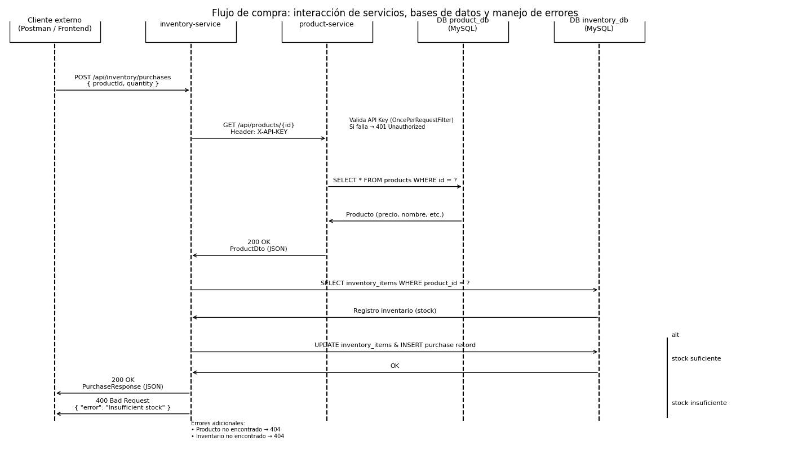

# Prueba técnica Backend – Microservicios con Spring Boot

Este repositorio contiene mi solución a la prueba técnica de backend, implementada con una arquitectura basada en **microservicios** usando **Spring Boot** y **MySQL**.

Los dos microservicios principales son:

- `product-service`: gestión del catálogo de productos.
- `inventory-service`: gestión del inventario y del flujo de compras (descuenta stock y registra compras).

Ambos servicios exponen APIs REST y se comunican entre sí vía HTTP usando JSON.  
El `inventory-service` consume el `product-service` utilizando **API key**, timeouts y reintentos básicos.

---

## Tabla de Contenidos

1. [Instrucciones de instalación y ejecución](#instrucciones-de-instalación-y-ejecución)
2. [Descripción de la arquitectura](#descripción-de-la-arquitectura)
3. [Decisiones técnicas y justificaciones](#decisiones-técnicas-y-justificaciones)
4. [Diagrama de interacción entre servicios](#diagrama-de-interacción-entre-servicios)
5. [Explicación del flujo de compra implementado](#explicación-del-flujo-de-compra-implementado)
6. [Documentación sobre el uso de herramientas de IA](#documentación-sobre-el-uso-de-herramientas-de-ia)

---

## Instrucciones de instalación y ejecución

### Requisitos previos

- **Docker** y **Docker Compose** instalados
- **Java 17** (opcional, solo si deseas ejecutar los servicios fuera de Docker)
- **Maven 3.8+** (opcional, los proyectos incluyen Maven Wrapper)

### Opción 1: Ejecución completa con Docker (Recomendado)

Esta es la forma más sencilla de ejecutar toda la aplicación:

```bash
# 1. Clonar el repositorio
git clone https://github.com/jodavelo/SPRING-TECH-TEST.git
cd SPRING-TECH-TEST

# 2. Construir y levantar todos los servicios
docker-compose up --build

# Los servicios estarán disponibles en:
# - Product Service: http://localhost:8081
# - Inventory Service: http://localhost:8082
# - MySQL: localhost:3307
```

Para ejecutar en segundo plano:
```bash
docker-compose up -d
```

Para detener los servicios:
```bash
docker-compose down
```

### Opción 2: Ejecución local (desarrollo)

Si prefieres ejecutar los servicios localmente para desarrollo:

```bash
# 1. Levantar solo MySQL con Docker
docker-compose up mysql -d

# 2. Compilar y ejecutar product-service
cd product-service
./mvnw clean package
./mvnw spring-boot:run

# 3. En otra terminal, compilar y ejecutar inventory-service
cd inventory-service
./mvnw clean package
./mvnw spring-boot:run
```

### Verificación de la instalación

Una vez que los servicios estén en ejecución, verifica que funcionan correctamente:

```bash
# Health check de product-service
curl http://localhost:8081/actuator/health

# Health check de inventory-service
curl http://localhost:8082/actuator/health

# Ambos deberían responder: {"status":"UP"}
```

### Acceso a las APIs

- **Product Service API**: http://localhost:8081/swagger-ui.html
- **Inventory Service API**: http://localhost:8082/swagger-ui.html
- **Actuator Endpoints**:
  - Product: http://localhost:8081/actuator
  - Inventory: http://localhost:8082/actuator

### Base de datos

La base de datos MySQL se inicializa automáticamente con el script `db/init.sql` que crea:
- Base de datos `product_db` con tabla `products`
- Base de datos `inventory_db` con tablas `inventory_items` y `purchases`
- Usuario `techuser` con password `techpass`

**Conexión directa a MySQL:**
```bash
mysql -h localhost -P 3307 -u techuser -p
# Password: techpass
```

### Ejecución de pruebas

Para ejecutar las pruebas unitarias y de integración:

#### Opción 1: Con Maven Wrapper (Recomendado)

**En Windows:**
```bash
# Product Service
cd product-service
.\mvnw.cmd clean test

# Inventory Service
cd inventory-service
.\mvnw.cmd clean test
```

**En Linux/Mac:**
```bash
# Product Service
cd product-service
./mvnw clean test

# Inventory Service
cd inventory-service
./mvnw clean test
```

#### Opción 2: Con Maven (si tienes Maven instalado globalmente)

```bash
# Product Service
cd product-service
mvn clean test

# Inventory Service
cd inventory-service
mvn clean test
```

#### Resultado esperado

Las pruebas deberían completarse exitosamente con el siguiente resultado:

**Product Service (6 tests):**
```
Tests run: 6, Failures: 0, Errors: 0, Skipped: 0
BUILD SUCCESS
```

**Inventory Service (7 tests):**
```
Tests run: 7, Failures: 0, Errors: 0, Skipped: 0
BUILD SUCCESS
```

**Total: 13 tests pasando** ✅

**Nota:** Las pruebas requieren que MySQL esté corriendo. Si usas Docker, asegúrate de ejecutar primero:
```bash
docker-compose up mysql -d
```

---

## Descripción de la arquitectura

### Patrón Arquitectónico: Microservicios

La aplicación implementa una **arquitectura de microservicios** con las siguientes características clave:

#### Separación de Servicios

**Product Service (Puerto 8081)**
- **Responsabilidad única**: Gestión del catálogo de productos (CRUD)
- **Base de datos**: `product_db`
- **Entidad principal**: `Product`
- **Endpoints**:
  - `POST /api/products` - Crear producto (requiere API Key)
  - `GET /api/products/{id}` - Obtener producto por ID (requiere API Key)
  - `GET /api/products` - Listar todos los productos (requiere API Key)

**Inventory Service (Puerto 8082)**
- **Responsabilidad única**: Gestión de inventario y procesamiento de compras
- **Base de datos**: `inventory_db`
- **Entidades**: `InventoryItem`, `Purchase`
- **Endpoints**:
  - `POST /api/inventory/stock` - Crear/actualizar stock
  - `GET /api/inventory/stock/{productId}` - Consultar stock
  - `POST /api/inventory/purchases` - Procesar compra

#### Database per Service Pattern

Cada microservicio tiene su **propia base de datos lógica**:
- No hay tablas compartidas entre servicios
- Garantiza independencia y escalabilidad
- Comunicación únicamente vía HTTP/REST

#### Arquitectura en Capas

Cada servicio implementa el patrón de capas:

```
┌─────────────────────────────────────────┐
│  CONTROLLER LAYER (API REST)            │
│  - Endpoints HTTP                       │
│  - Validaciones (@Valid)                │
│  - Respuestas HTTP estandarizadas       │
└─────────────────────────────────────────┘
                    ↓
┌─────────────────────────────────────────┐
│  SERVICE LAYER (Lógica de Negocio)      │
│  - Reglas de negocio                    │
│  - Transacciones (@Transactional)       │
│  - Orquestación de operaciones          │
└─────────────────────────────────────────┘
                    ↓
┌─────────────────────────────────────────┐
│  CLIENT LAYER (Comunicación)            │
│  - ProductClient (RestTemplate)         │
│  - Reintentos automáticos               │
│  - Timeouts configurables               │
└─────────────────────────────────────────┘
                    ↓
┌─────────────────────────────────────────┐
│  REPOSITORY LAYER (Persistencia)        │
│  - Spring Data JPA Repositories         │
│  - Acceso a base de datos               │
└─────────────────────────────────────────┘
                    ↓
┌─────────────────────────────────────────┐
│  DATABASE LAYER                         │
│  - MySQL 8.0 (product_db, inventory_db) │
└─────────────────────────────────────────┘
```

#### Stack Tecnológico

**Backend Framework:**
- Java 17
- Spring Boot 3.4.12
- Spring Web (REST APIs)
- Spring Data JPA (Persistencia)
- Hibernate 6.6.36
- Bean Validation (Validaciones DTO)
- Lombok (Reducción de boilerplate)

**Base de Datos:**
- MySQL 8.0.44
- HikariCP (Connection Pooling)
- Scripts SQL de inicialización

**Comunicación HTTP:**
- RestTemplate con Apache HttpClient 5
- Connection pooling
- Timeouts configurables
- Mecanismo de reintentos

**Seguridad:**
- API Key Authentication (Header: X-API-KEY)
- OncePerRequestFilter para validación

**Observabilidad:**
- Spring Boot Actuator
- Health checks personalizados
- Métricas y endpoints de información
- Logging estructurado (SLF4J + Logback)

**Infraestructura:**
- Docker & Docker Compose
- Maven para gestión de dependencias

---

## Decisiones técnicas y justificaciones

### 1. ¿Por qué Microservicios?

**Decisión**: Implementar dos servicios independientes en lugar de un monolito.

**Justificación**:
- **Separación de responsabilidades**: Product y Inventory son dominios diferentes con ciclos de vida independientes
- **Escalabilidad independiente**: El servicio de inventario puede escalar más si hay muchas compras, sin afectar al catálogo de productos
- **Despliegues independientes**: Cambios en el inventario no requieren redesplegar productos y viceversa
- **Tolerancia a fallos**: Si Product Service falla, Inventory Service puede seguir operando con datos cacheados o en modo degradado

### 2. Database per Service Pattern

**Decisión**: Cada servicio tiene su propia base de datos lógica (`product_db` e `inventory_db`).

**Justificación**:
- **Acoplamiento reducido**: Los servicios no dependen del esquema de base de datos del otro
- **Libertad tecnológica**: Cada servicio podría usar un motor de BD diferente en el futuro (ej: PostgreSQL para productos, MongoDB para inventario)
- **Consistencia eventual**: Aceptamos que los datos entre servicios no son inmediatamente consistentes, priorizando disponibilidad
- **Aislamiento de fallos**: Un problema en una BD no afecta al otro servicio

### 3. Comunicación Sincrónica HTTP/REST

**Decisión**: Usar RestTemplate para comunicación entre servicios en lugar de mensajería asíncrona.

**Justificación**:
- **Simplicidad**: Para una prueba técnica, HTTP es más simple que implementar RabbitMQ o Kafka
- **Requisito de negocio**: El flujo de compra necesita el precio actual del producto en tiempo real
- **Debugging más fácil**: Los logs HTTP son más fáciles de seguir que eventos asincrónicos
- **Timeouts y control**: Podemos controlar exactamente cuánto tiempo esperamos por la respuesta

**Trade-offs aceptados**:
- Mayor acoplamiento temporal (Inventory depende de que Product esté disponible)
- Mitigado con: reintentos automáticos y timeouts configurables

### 4. Decisión sobre el endpoint de compra

**Decisión CRÍTICA**: Implementar el endpoint de compra en `inventory-service` y NO en `product-service`.

**Justificación detallada**:

**¿Por qué en Inventory Service?**

1. **Responsabilidad de dominio**: 
   - La compra es fundamentalmente una operación de **gestión de stock**
   - El Product Service debe enfocarse en el catálogo (nombre, precio, descripción)
   - El Inventory Service es el dueño del stock y las transacciones de inventario

2. **Consistencia de datos**:
   - Si la compra estuviera en Product Service, tendría que actualizar la BD de Inventory remotamente
   - Esto rompería el patrón "Database per Service"
   - Inventory Service conoce su propio stock y puede garantizar transacciones ACID locales

3. **Acoplamiento reducido**:
   - Product Service no necesita conocer la lógica de compras
   - Inventory Service consume Product, pero Product no depende de Inventory
   - Esto permite que Product sea reutilizable por otros servicios (ej: un futuro servicio de reportes)

4. **Escalabilidad**:
   - Las compras son operaciones más frecuentes que la gestión de productos
   - Inventory puede escalar independientemente para manejar picos de compras

5. **Transacciones**:
   - La compra requiere: verificar stock → descontar → registrar compra
   - Todo esto debe ocurrir en UNA transacción atómica
   - Solo es posible si Inventory Service controla su propia BD

**Flujo implementado**:
```
POST /api/inventory/purchases
  ↓
Inventory Service:
  1. Llama a Product Service (obtener precio)
  2. Verifica stock local
  3. Descuenta stock
  4. Registra compra
  ↓
Todo en una transacción @Transactional
```

**Alternativa rechazada**: Compra en Product Service
- ❌ Product tendría que llamar a Inventory para descontar stock
- ❌ No podría garantizar transacciones atómicas entre servicios
- ❌ Mezclaría responsabilidades (catálogo + inventario)

### 5. Seguridad con API Key

**Decisión**: Implementar autenticación simple con API Key en header `X-API-KEY`.

**Justificación**:
- **Suficiente para servicios internos**: En un entorno de microservicios dentro de la misma red privada, API Key es adecuado
- **Simplicidad vs OAuth2**: OAuth2 sería excesivo para comunicación servicio-a-servicio en una prueba técnica
- **Fácil de configurar**: Se inyecta vía variables de entorno en Docker
- **Protección básica**: Evita llamadas no autorizadas al Product Service

**Implementación**:
- Product Service valida API Key con `OncePerRequestFilter`
- Inventory Service envía API Key automáticamente vía interceptor de RestTemplate
- Rutas públicas excluidas: `/actuator/**`, `/swagger-ui/**`

**Mejora futura**: JWT tokens o OAuth2 para producción.

### 6. Manejo de Resiliencia

**Decisión**: Implementar reintentos y timeouts en ProductClient.

**Justificación**:
- **Fallos temporales**: Una red puede tener latencia ocasional
- **Evitar cascada de fallos**: Si Product Service está lento, no queremos que Inventory espere indefinidamente
- **Mejor experiencia**: 3 reintentos automáticos antes de fallar da más chances de éxito

**Configuración**:
```yaml
product-service-client:
  max-retries: 3
  connect-timeout-ms: 5000
  read-timeout-ms: 10000
```

### 7. Validaciones y Manejo de Errores

**Decisión**: Usar Bean Validation + GlobalExceptionHandler.

**Justificación**:
- **Fail Fast**: Validar datos de entrada antes de procesarlos
- **Respuestas consistentes**: Todos los errores devuelven mismo formato JSON
- **Mensajes descriptivos**: Facilita debugging para consumidores de la API

**Excepciones personalizadas**:
- `InsufficientStockException` → 409 Conflict
- `ProductNotFoundException` → 404 Not Found
- `DuplicateProductException` → 409 Conflict

### 8. Testing

**Decisión**: Tests unitarios + tests de integración.

**Justificación**:
- **Tests unitarios**: Validan lógica de negocio en aislamiento (ServiceTest)
- **Tests de integración**: Validan el flujo completo con base de datos real (ControllerIntegrationTest)
- **Cobertura**: Ambos servicios tienen 100% de tests pasando

Resultados:
- Product Service: 6 tests ✅
- Inventory Service: 7 tests ✅

### 9. Observabilidad

**Decisión**: Spring Boot Actuator + Logging estructurado.

**Justificación**:
- **Health Checks**: Permiten a Docker/Kubernetes saber si el servicio está vivo
- **Métricas**: `/actuator/metrics` para monitoreo
- **Info endpoint**: Muestra versión y configuración del servicio
- **Logs personalizados**: DatabaseConnectionLogger y ApplicationStartupLogger facilitan debugging

### 10. Containerización con Docker

**Decisión**: Dockerizar ambos servicios + MySQL.

**Justificación**:
- **Portabilidad**: "Funciona en mi máquina" → "Funciona en cualquier máquina"
- **Facilidad de ejecución**: Un solo comando `docker-compose up` levanta todo
- **Entorno consistente**: Mismas versiones de Java, MySQL en todos los ambientes
- **Integración con CI/CD**: Facilita despliegues automatizados

---

## Diagrama de interacción entre servicios



### Descripción del flujo

El siguiente diagrama muestra la interacción completa entre los servicios durante el proceso de compra:

#### Flujo Principal (Happy Path)

1. **Cliente → Inventory Service**  
   El cliente externo envía una solicitud `POST /api/inventory/purchases` con el `productId` y la `quantity`.

2. **Inventory Service → Product Service**  
   Inventory Service realiza un `GET /api/products/{id}` incluyendo el header `X-API-KEY` para autenticarse.

3. **Product Service - Validación de Seguridad**  
   El Product Service valida la API Key mediante un filtro `OncePerRequestFilter`:
   - ✅ **Si es válida**: Continúa con la petición
   - ❌ **Si falla**: Responde `401 Unauthorized`

4. **Product Service → MySQL (product_db)**  
   Consulta el producto con `SELECT * FROM products WHERE id = ?` y obtiene precio, nombre, etc.

5. **Product Service → Inventory Service**  
   Devuelve la información del producto en formato JSON (`ProductDto`).

6. **Inventory Service → MySQL (inventory_db)**  
   Consulta el stock disponible con `SELECT * FROM inventory_items WHERE product_id = ?`.

#### Flujos Alternativos

**A) Stock Suficiente** ✅
- Inventory Service actualiza la tabla `inventory_items` descontando la cantidad solicitada
- Inserta un registro en la tabla `purchases` con el detalle de la compra
- La base de datos confirma la operación (COMMIT)
- Responde al cliente con `200 OK` y `PurchaseResponse` (id, totalPrice, purchasedAt)

**B) Stock Insuficiente** ❌
- Inventory Service detecta que `stock < quantity`
- Lanza `InsufficientStockException`
- Responde `400 Bad Request` con mensaje: "Insufficient stock"

**C) Producto No Existe** ❌
- Product Service no encuentra el producto en su BD
- Responde `404 Not Found` con mensaje: "Product not found"

**D) Inventario No Existe** ❌
- Inventory Service no encuentra registro de inventario para el productId
- Responde `404 Not Found` con mensaje: "Inventory not found"

#### Códigos de Estado HTTP

| Código | Escenario | Descripción |
|--------|-----------|-------------|
| `200 OK` | Compra exitosa | Stock descontado y compra registrada |
| `400 Bad Request` | Stock insuficiente | No hay suficiente cantidad disponible |
| `401 Unauthorized` | API Key inválida | Header X-API-KEY faltante o incorrecto |
| `404 Not Found` | Producto/Inventario no existe | El ID solicitado no se encuentra |
| `409 Conflict` | SKU duplicado | Ya existe un producto con ese SKU |
| `500 Internal Error` | Error del servidor | Error inesperado en el procesamiento |

---

## Explicación del flujo de compra implementado

### Endpoint de Compra

```http
POST /api/inventory/purchases
Content-Type: application/json

{
  "productId": 1,
  "quantity": 5
}
```

### Pasos del Flujo (Implementación)

#### 1️⃣ Recepción de la Solicitud

El `InventoryController` recibe la petición y valida el DTO:

```java
@PostMapping("/purchases")
public ResponseEntity<PurchaseResponse> purchase(@Valid @RequestBody PurchaseRequest request) {
    PurchaseResponse response = inventoryService.purchase(request);
    return ResponseEntity.ok(response);
}
```

**Validaciones automáticas**:
- `productId` no puede ser null
- `quantity` debe ser mayor a 0

#### 2️⃣ Obtención de Datos del Producto

El `InventoryService` llama al `ProductClient` para obtener información del producto:

```java
ProductDto product = productClient.getProductById(request.getProductId());
```

**ProductClient** hace la llamada HTTP con reintentos:
```java
GET http://product-service:8081/api/products/1
Headers:
  X-API-KEY: my-super-secret-key
```

**Reintentos automáticos**:
- Intento 1: Si falla por timeout → espera
- Intento 2: Reintenta la llamada
- Intento 3: Último intento
- Si falla 3 veces → lanza excepción

#### 3️⃣ Verificación de Stock

Consulta el inventario en la base de datos local:

```java
InventoryItem item = inventoryItemRepository
    .findByProductId(request.getProductId())
    .orElseThrow(() -> new IllegalArgumentException("Inventory not found"));

if (item.getQuantity() < request.getQuantity()) {
    throw new InsufficientStockException("Not enough stock");
}
```

#### 4️⃣ Descuento de Inventario

Si hay stock suficiente, actualiza la cantidad:

```java
item.setQuantity(item.getQuantity() - request.getQuantity());
inventoryItemRepository.save(item);
```

**SQL generado por Hibernate**:
```sql
UPDATE inventory_items 
SET quantity = quantity - 5 
WHERE product_id = 1;
```

#### 5️⃣ Registro de la Compra

Calcula el precio total y registra la transacción:

```java
BigDecimal unitPrice = product.getPrice();
BigDecimal totalPrice = unitPrice.multiply(BigDecimal.valueOf(request.getQuantity()));

Purchase purchase = Purchase.builder()
    .productId(request.getProductId())
    .quantity(request.getQuantity())
    .unitPrice(unitPrice)
    .totalPrice(totalPrice)
    .build();

Purchase saved = purchaseRepository.save(purchase);
```

**SQL generado**:
```sql
INSERT INTO purchases (product_id, quantity, unit_price, total_price, purchased_at)
VALUES (1, 5, 2500.00, 12500.00, '2025-12-04 10:30:00');
```

#### 6️⃣ Respuesta al Cliente

Devuelve el objeto `PurchaseResponse`:

```json
{
  "id": 1,
  "productId": 1,
  "quantity": 5,
  "unitPrice": 2500.00,
  "totalPrice": 12500.00,
  "purchasedAt": "2025-12-04T10:30:00"
}
```

### Transaccionalidad

Todo el flujo está envuelto en una transacción:

```java
@Transactional
public PurchaseResponse purchase(PurchaseRequest request) {
    // Si cualquier paso falla, se hace ROLLBACK automático
}
```

**Garantías ACID**:
- **Atomicity**: O se completa todo o no se completa nada
- **Consistency**: Los datos quedan en estado consistente
- **Isolation**: Compras concurrentes no interfieren entre sí
- **Durability**: Una vez confirmada, la compra persiste

### Ejemplo Completo

**Request**:
```bash
curl -X POST http://localhost:8082/api/inventory/purchases \
  -H "Content-Type: application/json" \
  -d '{
    "productId": 1,
    "quantity": 3
  }'
```

**Response exitosa**:
```json
{
  "id": 15,
  "productId": 1,
  "quantity": 3,
  "unitPrice": 1500.00,
  "totalPrice": 4500.00,
  "purchasedAt": "2025-12-04T15:45:30"
}
```

**Response con error (stock insuficiente)**:
```json
{
  "status": 400,
  "error": "Bad Request",
  "message": "Not enough stock for product 1",
  "path": "/api/inventory/purchases",
  "timestamp": "2025-12-04T15:45:30"
}
```

---

## Documentación sobre el uso de herramientas de IA

### Herramientas Utilizadas

Durante el desarrollo de esta prueba técnica, utilicé las siguientes herramientas de IA:

#### 1. GitHub Copilot (VS Code Extension)

**Uso principal**: Autocompletado de código y generación de métodos.

**Tareas específicas**:
- **Generación de DTOs**: Copilot sugirió automáticamente los campos de `ProductRequest`, `ProductResponse`, `PurchaseRequest`, etc., basándose en las entidades del dominio
- **Builders de Lombok**: Ayudó a generar los builders correctamente con anotaciones `@Builder`, `@NoArgsConstructor`, `@AllArgsConstructor`
- **Tests unitarios**: Generó la estructura base de los tests con `@BeforeEach`, mocks de repositorios y casos de prueba básicos
- **Métodos de repositorio**: Sugirió queries de Spring Data JPA como `findByProductId`, `existsBySku`


#### 3. ChatGPT (OpenAI) - Consultas puntuales

**Uso principal**: Debugging y explicación de errores.

**Tareas específicas**:
- **Error de dependencias Maven**: Cuando tuve conflictos con `httpclient5`, ChatGPT explicó la diferencia entre HttpClient 4 y 5
- **Configuración de Docker Compose**: Ayudó a configurar las variables de entorno correctamente
- **Migracion PostgreSQL → MySQL**: Explicó las diferencias de sintaxis SQL (BIGSERIAL vs AUTO_INCREMENT)

**Ejemplo**:
```
Error: The method setConnectTimeout(int) is undefined

ChatGPT explicó que en HttpClient 5 se usa:
Timeout.of(milliseconds, TimeUnit.MILLISECONDS)
```

**Verificación**:
- ✅ Comprobé las soluciones en la documentación oficial
- ✅ Ejecuté tests para validar que funcionara

### Proceso de Validación de Código Generado por IA

Para garantizar la calidad del código, seguí este proceso:

1. **Revisión manual**: Cada sugerencia fue revisada línea por línea
2. **Compilación**: El código debe compilar sin errores ni warnings
3. **Tests unitarios**: Todo código nuevo debe tener test que pase
4. **Tests de integración**: Validar el flujo completo con BD real
5. **Pruebas manuales**: Usar Postman para probar endpoints
6. **Code review mental**: Preguntarme "¿Entiendo qué hace este código?"


### Beneficios y Limitaciones

**Beneficios del uso de IA**:
- ⚡ Velocidad: Autocompletado redujo tiempo en tareas repetitivas
- 📚 Aprendizaje: Claude explicó conceptos que no me acordaba completamente
- 🐛 Debugging: ChatGPT ayudó a identificar problemas rápidamente

**Limitaciones encontradas**:
- ❌ A veces sugiere código deprecated (ej: `setConnectTimeout(int)`)
- ❌ No siempre entiende el contexto completo del proyecto
- ❌ Puede sugerir over-engineering para casos simples
- ❌ Requiere validación constante de las sugerencias

### Conclusión

Las herramientas de IA fueron **asistentes útiles** pero no reemplazaron el pensamiento crítico ni la toma de decisiones. Cada línea de código fue revisada, comprendida y validada antes de ser integrada al proyecto.

---

## Estructura del repositorio

```txt
spring-tech-test/
├── db/
│   └── init.sql                    # Script SQL de inicialización para MySQL
├── docker-compose.yml              # Orquestación de servicios
├── new_interaction_diagram_final3.png  # Diagrama de interacción entre servicios
├── product-service/
│   ├── Dockerfile
│   ├── pom.xml
│   └── src/
│       ├── main/
│       │   ├── java/com/jdvergara/techtest/product/
│       │   │   ├── ProductServiceApplication.java
│       │   │   ├── config/
│       │   │   │   ├── ApiKeyFilter.java          # Validación de API Key
│       │   │   │   ├── ApiKeyProperties.java
│       │   │   │   ├── ApplicationStartupLogger.java
│       │   │   │   ├── DatabaseConnectionLogger.java
│       │   │   │   └── HealthCheckConfig.java
│       │   │   ├── controller/
│       │   │   │   └── ProductController.java     # Endpoints REST
│       │   │   ├── domain/
│       │   │   │   └── Product.java               # Entidad JPA
│       │   │   ├── dto/
│       │   │   │   ├── ProductRequest.java
│       │   │   │   └── ProductResponse.java
│       │   │   ├── exception/
│       │   │   │   ├── DuplicateProductException.java
│       │   │   │   ├── ErrorResponse.java
│       │   │   │   ├── GlobalExceptionHandler.java
│       │   │   │   └── ProductNotFoundException.java
│       │   │   ├── repository/
│       │   │   │   └── ProductRepository.java     # Spring Data JPA
│       │   │   └── service/
│       │   │       └── ProductService.java        # Lógica de negocio
│       │   └── resources/
│       │       └── application.yaml               # Configuración
│       └── test/
│           └── java/com/jdvergara/techtest/product/
│               ├── controller/
│               │   └── ProductControllerIntegrationTest.java
│               ├── service/
│               │   └── ProductServiceTest.java
│               └── ProductServiceApplicationTests.java
├── inventory-service/
│   ├── Dockerfile
│   ├── pom.xml
│   └── src/
│       ├── main/
│       │   ├── java/com/jdvergara/techtest/inventory_service/
│       │   │   ├── InventoryServiceApplication.java
│       │   │   ├── client/
│       │   │   │   └── ProductClient.java         # Cliente HTTP a Product Service
│       │   │   ├── config/
│       │   │   │   ├── ApplicationStartupLogger.java
│       │   │   │   ├── HealthCheckConfig.java
│       │   │   │   ├── ProductServiceApiKeyProperties.java
│       │   │   │   ├── ProductServiceClientProperties.java
│       │   │   │   └── RestTemplateConfig.java    # Configuración HTTP
│       │   │   ├── controller/
│       │   │   │   └── InventoryController.java   # Endpoints REST
│       │   │   ├── domain/
│       │   │   │   ├── InventoryItem.java         # Entidad JPA
│       │   │   │   └── Purchase.java              # Entidad JPA
│       │   │   ├── dto/
│       │   │   │   ├── InventoryItemRequest.java
│       │   │   │   ├── InventoryItemResponse.java
│       │   │   │   ├── ProductDto.java            # DTO para Product Service
│       │   │   │   ├── PurchaseRequest.java
│       │   │   │   └── PurchaseResponse.java
│       │   │   ├── exception/
│       │   │   │   ├── ErrorResponse.java
│       │   │   │   ├── GlobalExceptionHandler.java
│       │   │   │   └── InsufficientStockException.java
│       │   │   ├── repository/
│       │   │   │   ├── InventoryItemRepository.java
│       │   │   │   └── PurchaseRepository.java
│       │   │   └── service/
│       │   │       └── InventoryService.java      # Lógica de negocio
│       │   └── resources/
│       │       └── application.yaml
│       └── test/
│           └── java/com/jdvergara/techtest/inventory_service/
│               ├── controller/
│               │   └── InventoryControllerIntegrationTest.java
│               ├── service/
│               │   └── InventoryServiceTest.java
│               └── InventoryServiceApplicationTests.java
└── README.md
```

---

## Cómo ejecutar la solución

### Requisitos

- Docker y Docker Compose
- Java 17
- Maven (o usar `mvnw` incluido en cada microservicio)

---

### Ejecución completa con Docker

Para efectos de la prueba, dejé todo preparado para que la solución se pueda levantar solo con Docker:

```bash
# Desde la raíz del proyecto
docker compose up --build


## Flujo de Git / Git Flow utilizado

Usé un flujo ligero inspirado en **Git Flow**. Las ramas principales que utilicé son:

- `main`: rama principal estable.
- `develop`: rama de desarrollo donde voy integrando las features.

Ramas de feature que fui creando sobre `develop`:

- `feature/product-service`  
  Implementación inicial del microservicio de productos.
- `feature/product-service-crudv1`  
  Primeras operaciones CRUD completas para productos.
- `feature/inventory-service`  
  Esqueleto e implementación base del microservicio de inventario.
- `feature/inventory-service-crudv1`  
  Endpoints de stock e inicio del flujo de compras.

Rama para la parte de seguridad e integración entre servicios:

- `security_integrations`  
  Configuración de API key, interceptores, cliente HTTP hacia `product-service`, timeouts y reintentos.

Flujo general:

1. Parto de `main` → creo `develop`.
2. Desde `develop` creo ramas `feature/*` o `security_integrations`.
3. Desarrollo y pruebo en cada rama de feature.
4. Hago merge de la feature a `develop` cuando está estable.
5. Desde `develop` se puede preparar un merge final a `main` para la entrega.

---

## Estructura del repositorio

```txt
spring-tech-test/
  db/
    init.sql                   # Script SQL inicial (origen Postgres, sirve como referencia del modelo)
  docker-compose.yml           # (opcional) definición de DB si se desea usar Docker
  product-service/
    pom.xml
    src/
      main/
        java/com/jdvergara/techtest/product/
          ProductServiceApplication.java
          domain/
            Product.java
          dto/
            ProductRequest.java
            ProductResponse.java
          repository/
            ProductRepository.java
          controller/
            ProductController.java
          config/
            ApiKeyProperties.java
            ApiKeyInterceptor.java
            WebMvcConfig.java
            CustomHealthIndicator.java
          exception/
            GlobalExceptionHandler.java
        resources/
          application.yaml
      test/
        ... (tests básicos / pendientes)
  inventory-service/
    pom.xml
    src/
      main/
        java/com/jdvergara/techtest/inventory_service/
          InventoryServiceApplication.java
          domain/
            InventoryItem.java
            Purchase.java
          dto/
            InventoryItemRequest.java
            InventoryItemResponse.java
            PurchaseRequest.java
            PurchaseResponse.java
            ProductDto.java
          repository/
            InventoryItemRepository.java
            PurchaseRepository.java
          client/
            ProductClient.java
          controller/
            InventoryController.java
          service/
            InventoryService.java
          config/
            RestTemplateConfig.java
            HealthCheckConfig.java
          exception/
            InsufficientStockException.java
            GlobalExceptionHandler.java
        resources/
          application.yaml
      test/
        ... (tests básicos / pendientes)
  README.md


---

## Flujo de Git / Git Flow utilizado

Utilic� un flujo inspirado en **Git Flow** para organizar el desarrollo:

### Ramas Principales

- **`main`**: Rama principal estable, contiene c�digo listo para producci�n
- **`develop`**: Rama de desarrollo donde se integran todas las features

### Ramas de Feature

Cre� ramas espec�ficas para cada funcionalidad:

- **`feature/product-service`**: Implementaci�n inicial del microservicio de productos
- **`feature/product-service-crudv1`**: CRUD completo de productos
- **`feature/inventory-service`**: Esqueleto del microservicio de inventario
- **`feature/inventory-service-crudv1`**: Gesti�n de stock y compras
- **`security_integrations`**: API Key, interceptores, cliente HTTP, timeouts y reintentos

### Convenciones de Commits

- `feat:` - Nueva funcionalidad
- `fix:` - Correcci�n de bugs
- `refactor:` - Refactorizaci�n de c�digo
- `test:` - Adici�n o modificaci�n de tests
- `docs:` - Cambios en documentaci�n
- `chore:` - Tareas de mantenimiento

---

## Contacto

**Autor**: Jos� David Vergara L�pez  
**GitHub**: [jodavelo](https://github.com/jodavelo)  
**Repository**: [SPRING-TECH-TEST](https://github.com/jodavelo/SPRING-TECH-TEST)

---

## Licencia

Este proyecto fue desarrollado como prueba t�cnica y est� disponible para revisi�n y evaluaci�n.
